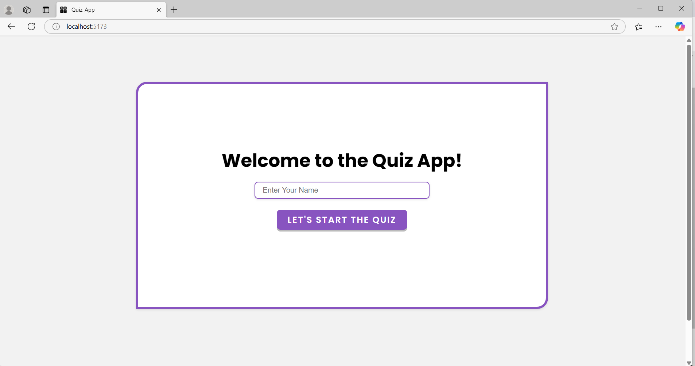
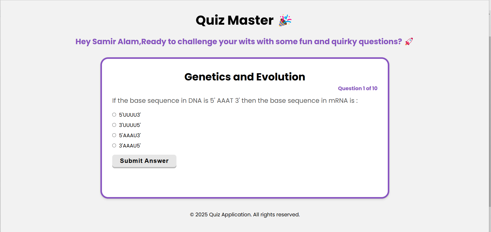
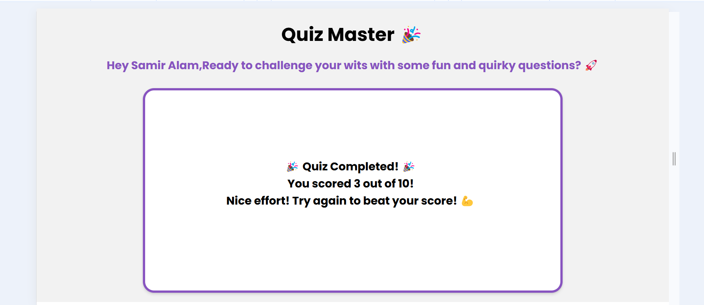

# 🎯 Quiz Application with Gamification

## 📌 Overview
This project is a web-based quiz application designed to provide an engaging and interactive experience using gamification elements. The application fetches quiz data from a public API and presents multiple-choice questions to users, displaying a summary of their results upon completion.

## ✨ Features
- 🏁 **Start Quiz**: Users can begin a timed quiz session.
- ✅ **Multiple-Choice Questions**: Questions with multiple answer options.
- 🎯 **Score Tracking**: Users receive points based on correct answers.
- 📊 **Summary of Results**: Displays total points scored at the end of the quiz.
- 🎮 **Gamification Elements**: Fun scoring and feedback mechanisms to enhance user engagement.

## 🛠️ Technologies Used
- ⚛️ **Frontend Framework**: [React](https://reactjs.org/)
- 🔗 **API Handling**: Axios for fetching quiz data
- 🎨 **Styling**: CSS for a modern UI
- 🎛 **State Management**: React Hooks

## 🚀 Setup Instructions
To run this project locally, follow these steps:

1. **Clone the repository**:
   ```bash
   git clone <your-repository-url>
   ```
2. **Navigate to the project directory**:
   ```bash
   cd quiz-app
   ```
3. **Install dependencies**:
   ```bash
   npm install
   ```
4. **Start the development server**:
   ```bash
   npm run dev
   ```
5. **Open the application**:
   Navigate to `http://localhost:5173` in your browser.

## 🖼️ Screenshots
Here are some screenshots showcasing the application:

### 🏁 Quiz Start Screen


### ❓ Question Example


### 🏆 Results Summary


## 🎥 Demo Video
Watch the live demo here: [Watch Demo](screenshots/quiz-app-demo-vide.mp4)

## 🔗 API Source
The quiz data is fetched from the following API:
- [Quiz API](https://api.jsonserve.com/Uw5CrX)

## 🤝 How to Contribute
Contributions are welcome! If you'd like to improve the quiz experience or add new features, follow these steps:

1. **Fork the repository**
2. **Create a feature branch**: `git checkout -b feature-name`
3. **Commit your changes**: `git commit -m "Add new feature"`
4. **Push to your branch**: `git push origin feature-name`
5. **Create a Pull Request**

## 📜 License
This project is licensed under the MIT License - see the [LICENSE](LICENSE) file for details.

## 🙌 Acknowledgments
- 💡 Inspired by various quiz applications that enhance learning through gamification.

---

If you have any suggestions or need additional modifications, feel free to ask! 🚀

